---
# You can also start simply with 'default'
theme: default
# random image from a curated Unsplash collection by Anthony
# like them? see https://unsplash.com/collections/94734566/slidev
background: /skybox.webp
# some information about your slides (markdown enabled)
title: Presentation | Spacedroid
# apply unocss classes to the current slide
class: text-center
# https://sli.dev/features/drawing
drawings:
  persist: false
# slide transition: https://sli.dev/guide/animations.html#slide-transitions
transition: slide-left
# enable MDC Syntax: https://sli.dev/features/mdc
level: 2
mdc: true
---

# Spacedroid
Group 11

<div class="flex justify-center items-center w-100% gap-12">
  
  <pre class="text-5xl">⨉</pre>
  
</div>


---

# Brief Project Description

- Project Client: IBM
- Project Summary: VR Quiz Game utilising and promoting IBM SkillsBuild badges.
- Project Being Presented: Game prototype meeting minimum viable product (MVP) requirements set by team internally.

---

# Minimum Viable Product
<p class="flex h-80% w-100% items-center justify-center italic text-xl text-center">"A space themed VR quiz game that works, with adaptive difficulty targeting IBM users using the IBM SkillsBuild Platform"</p>

---

# System Architecture: Initial Draft
<div class="flex justify-center w-100%">
  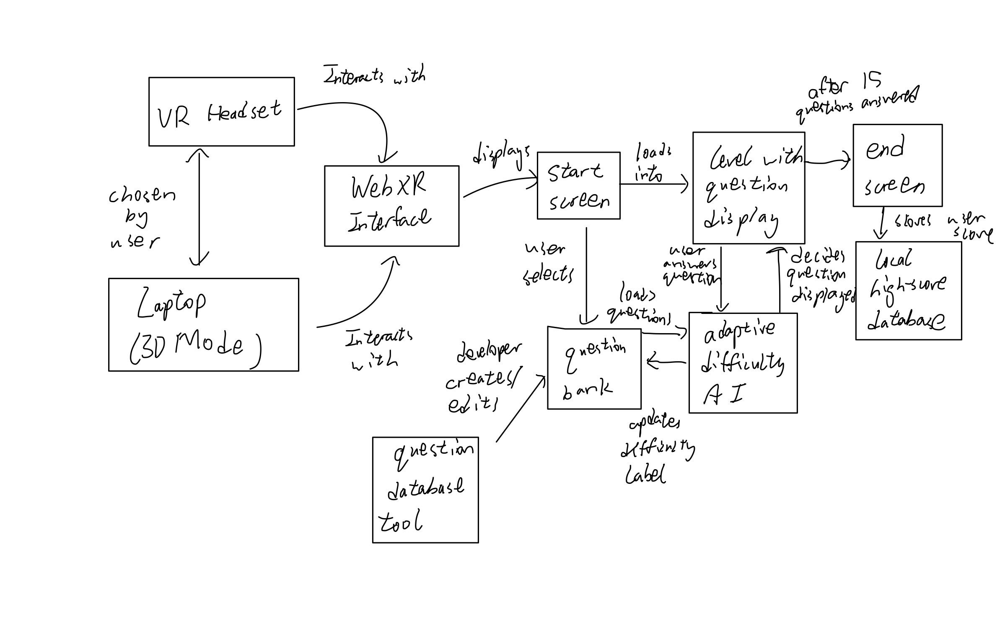
</div>

---

# System Architecture: Final
<div class="flex justify-center w-100%">
  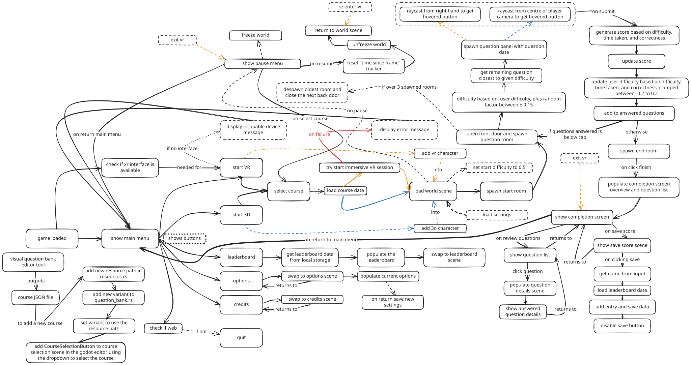
</div>

---

# Behavioural Requirements

We set out to complete 38 behavioural requirements, and achieved the following:


---

# Requirements Specification
### VR specific features
- BR1.1 (Look around with VR headset):
  - Fully met using WebXR in Godot.
  - Headset movement rotates the view as expected.
- BR1.2 (Look around with left thumbstick):
  - Fully met; controller input works smoothly.
  - Tested on Meta Quest 2 and 3.
- BR1.3 (Move with right thumbstick):
  - Fully met; smooth movement via Godot input.
BR1.4 (Teleport via VR controller trigger):
  - Not met; unnecessary due to small room sizes.

---

# Requirements Specification
### 3D Mode and Non-VR Experience
- BR2.1, BR2.2 (Movement Controls): Fully met
  - Keyboard and mouse controls fully functional.
  - Controller controls fully functional.
- BR3.2 (Non-VR Prompt): Not met
  - Users are not prompted to play in 3D instead when VR is not available.
- BR3.3 (WASM support check): Not met
  - Users are not informed when their browser doesn't support WASM
  - Non priority since all modern browsers support WASM and have it enabled by default
  - Message is logged in devtools console

---

# Requirements Specification
### Accessibility & User Experience

- BR4.3, BR4.4 (Pause and Resume Functions): Fully met
  - Easy pausing and resuming via VR controller or keyboard.

---

# Requirements Specification
### Game Experience

- BR5.1, BR5.3 (Game Session Completes in 15 Minutes, and returns to main menu after completion): Fully met
  - Session is short in length (10-15 minutes) with return to main menu after completion of game
- BR6.1, BR6.2 (Select, enter course and exit course menu): Fully met
  - User is able to enter menu, exit menu and select course
- BR7.1 (Review Incorrect Answers): Fully Met
  - Post-session review shows questions, user answer and actual answer

---

# Requirements Specification
### Answering Questions and Leaderboard

- BR8.1, BR8.2, BR8.3 (Points calculation for questions): Fully met
  - Points for correct answer, extra for doing it quickly, no points for wrong answer
- BR9.1, BR9.2, BR9.3 (Leaderboard): Fully met
  - Leaderboard system accessible from main menu sorted by score
- BR10.1, BR10.2, BR10.3 (Adaptive Difficulty): Fully met
  - User local difficulty changes based on answering question either correctly or wrongly, also based on question difficulty, which changes based on user answering it correctly or wrongly. Question displayed is based on user local difficulty.

---

# Requirements Specification
### Requirements Not Met

- BR4.1, BR4.5 (Save function): Not met
  - Save function not implemented due to short game length
- BR6.2, BR6.3 (Reccomend and show IBM SkillsBuild Course): Not met
  - Have not met for now due to time constraints, will revisit later.
- BR11.1, BR11.3 (Visual and Motor Accessibility Options): Not met
  - Implementation more challenging than expected, need more time, not in MVP.
- BR12.1 (Multiplayer): Not met
  - Needs more time to be fully implemented, advanced stretch feature.

---
layout: center
---

# Game VR Showcase

---
transition: slide-up
---

# Question Bank Tool

<div class="flex justify-center items-center w-100% h-80%">
  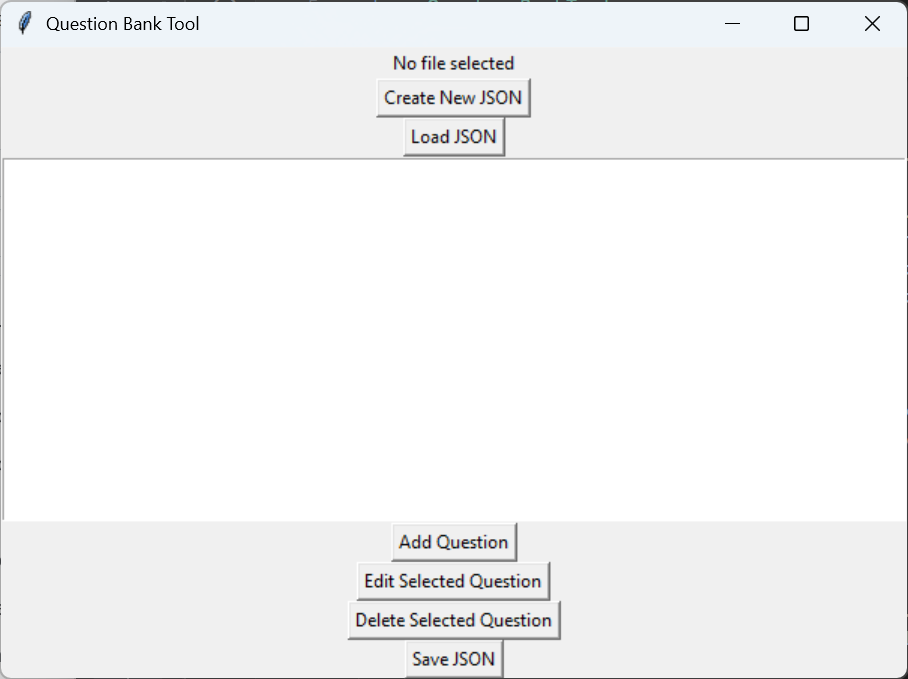
</div>

---
transition: slide-up
---

<div class="flex justify-center items-center w-100% h-100%">
  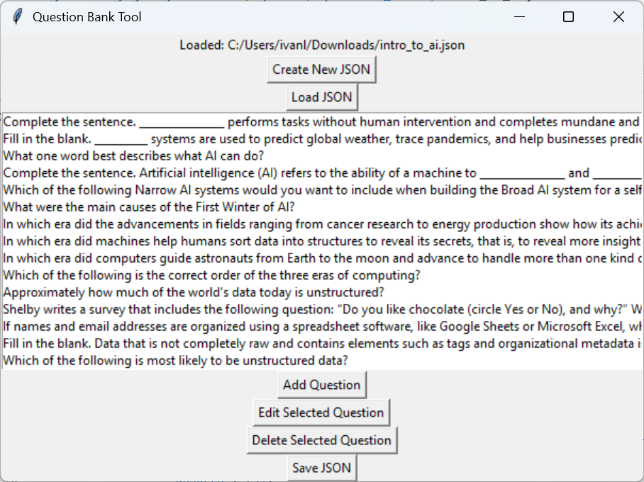
</div>

---
transition: slide-up
---

<div class="flex justify-center items-center w-100% h-100%">
  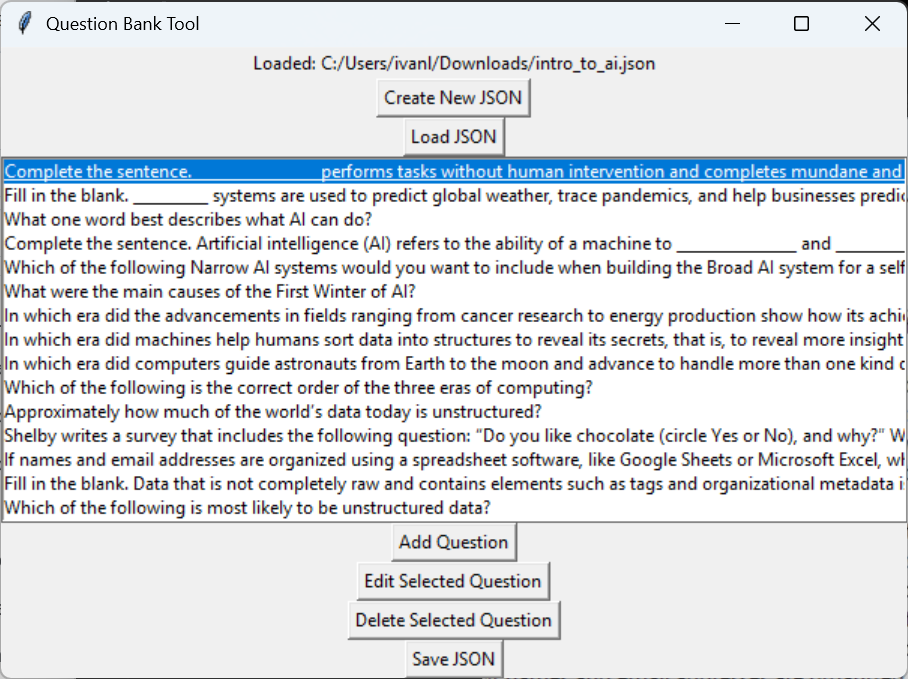
</div>

---
transition: slide-left
---

<div class="flex justify-center items-center w-100% h-100%">
  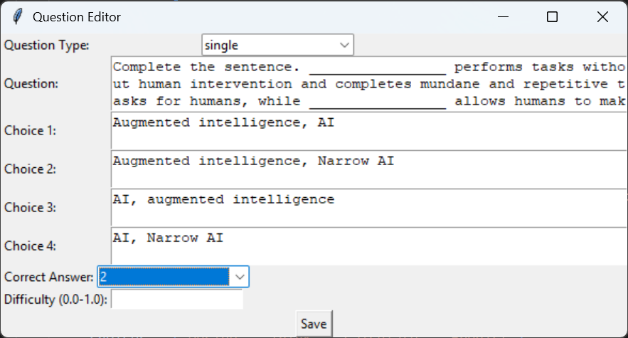
</div>


---

# Product handover


For installation and deployment, we have a comprehensive `DEPLOYMENT.md` file which covers how to build and export the project in lots of different ways (for different usecases).

We have also provided a `CONTRIBUTING.md` which explains the general structure of the project, along with some more nuance details.

Finally, we also have a public deployment of the project, which is created through our github workflow upon pushing to the main branch: https://ibm.alexdias.dev/

---
transition: slide-up
---

# Deployment

First install the required tooling:
- `pacman -Syu git just clang` (arch linux)
- `brew install git just clang` (macos)
- `winget install -e --id Casey.Just`, `winget install -e --id Git.Git`, and `winget install -e --id LLVM.LLVM` (windows)

<v-click>

Then easily get started by cloning the git repo:
- `git clone git@github.com:COMP2281/software-engineering-group24-25-11.git`

</v-click>

<v-click>

And calling:
- `just setup`

</v-click>

---
layout: center
class: text-center text-3xl
---

That's it!

---
transition: slide-up
---

# Deployment

After the setup has completed, you need to compile the rust library, you can do this with `just rust-debug rust-release`, there are also alternative recipes that can make building less cumbersome, such as `just dev-all` which builds whenever there are changes to the library, and also `just dev-web` to produce the web export whenever the project changes. See `DEPLOYMENT.md` for more information.

You can see a full list using `just --list`.

Now after installing godot's export templates (`Project -> Export... -> Web (runnable)`, then `Manage export templates -> Download and install`), you can proceed to running the game locally!

This is as simple as pressing the `Play` button, or the `Remote Deploy` button. Pressing play opens the game locally, while remote deploy opens a web server.

---

<div class="flex justify-center w-100%">
  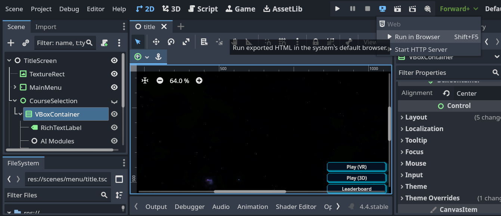
</div>


---

# Deployment: Usage on VR headsets

Deploying the game for usage on VR headsets is slightly more complicated, it requires hosting your own HTTPS server on a domain (or host with a SSL certificate).

<v-click>

These were bypassed before since we were only accessing the game through localhost using the `remote deploy`, which is an common exception made by browsers.

</v-click>

<v-click>

In order to run the game in the web we require a secure context, meaning that we require HTTPs, and also to set some HTTP headers for the provided static files.

</v-click>

<v-click>

Therefore to make this easy, our `DEPLOYMENT.md` document goes over how to setup a domain to serve as a host for the static files, along with how to produce the static files (`just release-web`)

</v-click>


<v-click>

We also included a github workflow which publishes to a public Netlify site to make this easier, since it can be both used as an example, and as an actual means to host the game.

Instructions on how to setup the workflow were provided in the `DEPLOYMENT.md` file.

</v-click>

---
 
# Contributing

Our project is primarily written in rust by creating new classes which inherit from godot's base classes. These classes then provide extra methods and functionality where needed.

We have 3 main overarching classes which handle the majority of state in the game:
- Title screen
- World
- Completion screen

And conversely, a class that handles swapping interactions between them: Scene Manager


---

The scene manager does the heavy lifting, setting up VR, entering the world, exiting the world, etc.
It also provides access to other root nodes such as the `SFXController`, used to play sounds.

On the other hand, the overarching scenes provide methods local to themselves, along with appropriate constructors.
These are the "root" nodes of their respective content, with other subclasses being able to refer to them through the scene manager.

More information is available in our `CONTRIBUTING.md` file, which also contains our game flow diagram from before.


---
transition: slide-up
---

# Adding a new course

After creating a new question bank using the question bank tool, you can easily add it to the game by doing the following.

````md magic-move {lines: true}
```rust
// file: rust/src/resources.rs
// ...
// Databank paths
pub mod courses {
    pub const DATA_FUNDAMENTALS: &str = "res://question_bank/data_fundamentals.json";
    pub const WEB_DEV: &str = "res://question_bank/web_dev.json";
    pub const INTRO_TO_AI: &str = "res://question_bank/intro_to_ai.json";
}
```

```rust {9}
// file: rust/src/resources.rs
// ...
// Databank paths
pub mod courses {
    pub const DATA_FUNDAMENTALS: &str = "res://question_bank/data_fundamentals.json";
    pub const WEB_DEV: &str = "res://question_bank/web_dev.json";
    pub const INTRO_TO_AI: &str = "res://question_bank/intro_to_ai.json";

    pub const NEW_COURSE: &str = "res://question_bank/new_course.json";
}
```
````

---
transition: slide-up
---

````md magic-move {lines: true}
```rust
// file: rust/src/question_bank.rs
// ...
#[derive(Debug, Default, GodotConvert, Var, Export, Copy, Clone)]
#[godot(via = u8)]
pub enum Course {
    #[default]
    DataFundamentals,
    WebDev,
    IntroToAi,
}

impl From<Course> for GString {
    fn from(value: Course) -> Self {
        match value {
            Course::DataFundamentals => resources::courses::DATA_FUNDAMENTALS.into(),
            Course::WebDev => resources::courses::WEB_DEV.into(),
            Course::IntroToAi => resources::courses::INTRO_TO_AI.into(),
        }
    }
}
```

```rust {10,19}
// file: rust/src/question_bank.rs
// ...
#[derive(Debug, Default, GodotConvert, Var, Export, Copy, Clone)]
#[godot(via = u8)]
pub enum Course {
    #[default]
    DataFundamentals,
    WebDev,
    IntroToAi,
    NewCourse,
}

impl From<Course> for GString {
    fn from(value: Course) -> Self {
        match value {
            Course::DataFundamentals => resources::courses::DATA_FUNDAMENTALS.into(),
            Course::WebDev => resources::courses::WEB_DEV.into(),
            Course::IntroToAi => resources::courses::INTRO_TO_AI.into(),
            Course::NewCourse => resources::courses::NEW_COURSE.into(),
        }
    }
}
```
````

---
transition: slide-up
---

<div class="flex justify-center w-100%">
  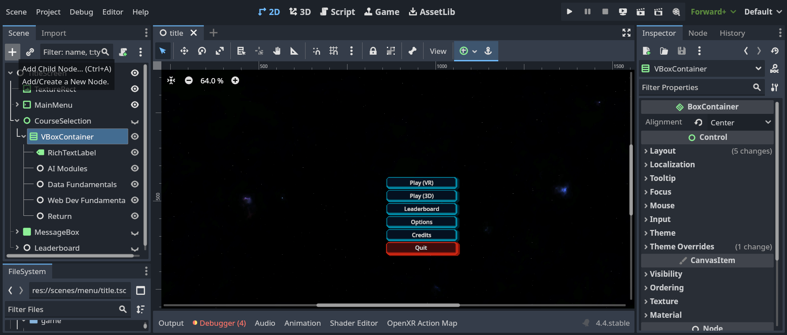
</div>

---
transition: slide-up
---

<div class="flex justify-center w-100%">
  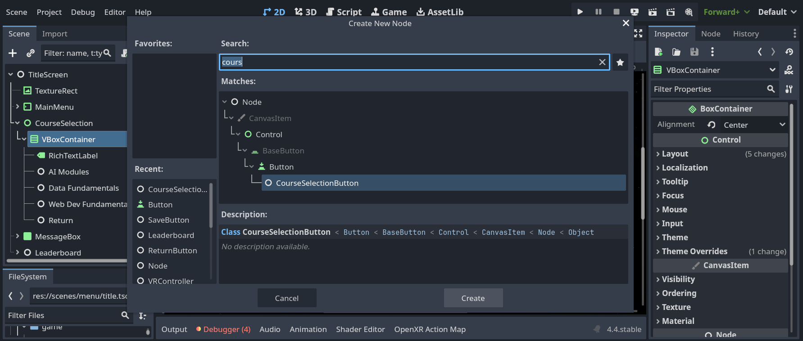
</div>

---
transition: slide-up
---

<div class="flex justify-center w-100%">
  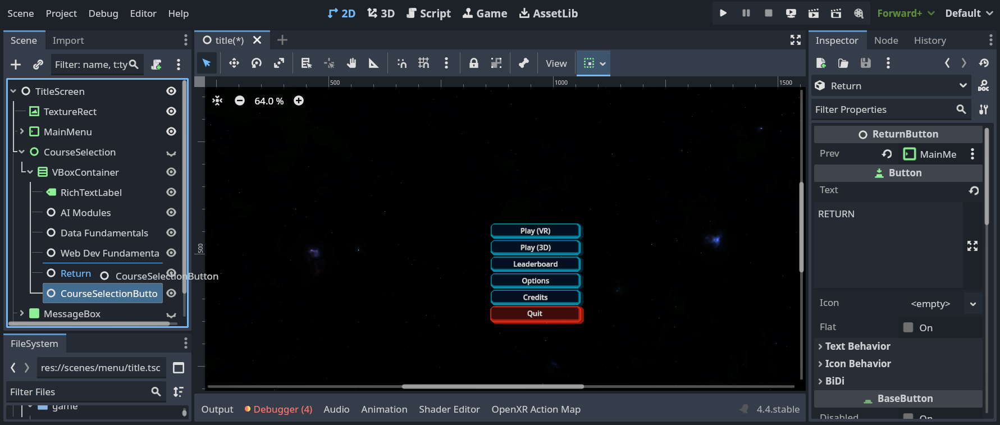
</div>

---
transition: slide-left
---

<div class="flex justify-center w-100%">
  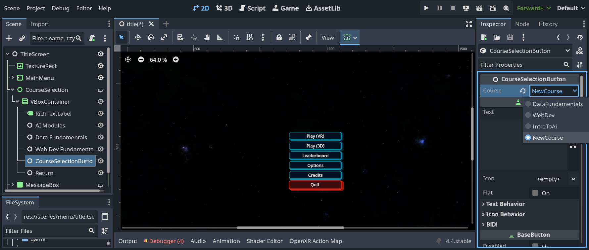
</div>

---
layout: center
---

# Any Questions?

